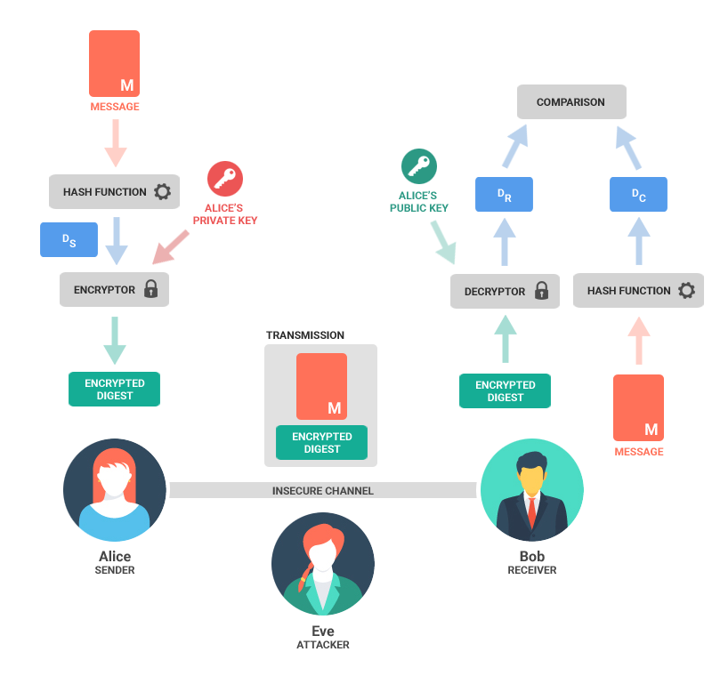

# 计算机密码学基础

## 常见加密方式


### 1.对称加密

* 采用单钥密码系统的加密方法，同一个密钥可以同时用作信息的加密和解密，这种加密方法称为对称加密，也称为单密钥加密。
* 示例
  * 我们现在有一个原文3要发送给B
  * 设置密钥为108, 3 * 108 = 324, 将324作为密文发送给B
  * B拿到密文324后, 使用324/108 = 3 得到原文
* 常见加密算法
  * DES : Data Encryption Standard，即数据加密标准，是一种使用密钥加密的块算法，1977年被美国联邦政府的国家标准局确定为联邦资料处理标准（FIPS），并授权在非密级政府通信中使用，随后该算法在国际上广泛流传开来。
  * AES : Advanced Encryption Standard, 高级加密标准 .在密码学中又称Rijndael加密法，是美国联邦政府采用的一种区块加密标准。这个标准用来替代原先的DES，已经被多方分析且广为全世界所使用。
* 特点
  * 加密速度快, 可以加密大文件
  * 密文可逆, 一旦密钥文件泄漏, 就会导致数据暴露
  * 加密后编码表找不到对应字符, 出现乱码
  * 一般结合Base64使用 

#### 1.1.DES加密解密

* 示例代码,参考源码DESUtil

* 
  <blockquote>
  <p>Base64是网络上最常见的用于传输8Bit字节码的可读性编码算法之一</p>
  <p>可读性编码算法不是为了保护数据的安全性，而是为了可读性</p>
  <p>可读性编码不改变信息内容，只改变信息内容的表现形式</p>
  <p>所谓Base64，即是说在编码过程中使用了64种字符：大写A到Z、小写a到z、数字0到9、“+”和“/”</p>
  <p>Base58是Bitcoin中使用的一种编码方式，主要用于产生Bitcoin的钱包地址</p>
  <p>相比Base64，Base58不使用数字"0"，字母大写"O"，字母大写"I"，和字母小写"i"，以及"+"和"/"符号</p>
  </blockquote>

#### 1.3.AES加密解密

* 示例代码,参考源码AESUtil


###  2.加密模式

####  2.1.ECB
* ECB : Electronic codebook, 电子密码本. 需要加密的消息按照块密码的块大小被分为数个块，并对每个块进行独立加密
* 
* 优点 : 可以并行处理数据
* 缺点 : 同样的原文生成同样的密文, 不能很好的保护数据

####  2.2.CBC
* CBC : Cipher-block chaining, 密码块链接. 每个明文块先与前一个密文块进行异或后，再进行加密。在这种方法中，每个密文块都依赖于它前面的所有明文块
* 
* 优点 : 同样的原文生成的密文不一样
* 缺点 : 串行处理数据. 

#### 2.3.填充模式

*  当需要按块处理的数据, 数据长度不符合块处理需求时, 按照一定的方法填充满块长的规则

##### NoPadding

* 不填充. 
* 在DES加密算法下, 要求原文长度必须是8byte的整数倍
* 在AES加密算法下, 要求原文长度必须是16byte的整数倍

##### PKCS5Padding 

* 数据块的大小为8位, 不够就补足

#### Tips

* 默认情况下, 加密模式和填充模式为 : ECB/PKCS5Padding
* 如果使用CBC模式, 在初始化Cipher对象时, 需要增加参数, 初始化向量IV : IvParameterSpec iv = new IvParameterSpec(key.getBytes());

### 3.消息摘要

* 消息摘要（Message Digest）又称为数字摘要(Digital Digest)
* 它是一个唯一对应一个消息或文本的固定长度的值，它由一个单向Hash加密函数对消息进行作用而产生

#### 特点

* 无论输入的消息有多长，计算出来的消息摘要的长度总是固定的。例如应用MD5算法摘要的消息有128个比特位，用SHA-1算法摘要的消息最终有160比特位的输出
* 只要输入的消息不同，对其进行摘要以后产生的摘要消息也必不相同；但相同的输入必会产生相同的输出
* 消息摘要是单向、不可逆的
* 常见算法 :
  * MD5
  * SHA1
  * SHA256
  * SHA512
* [在线获取消息摘要](http://tool.oschina.net/encrypt?type=2) 
* 示例代码,参考源码DigestUtil

#### 总结

* MD5算法 : 摘要结果16个字节, 转16进制后32个字节
* SHA1算法 : 摘要结果20个字节, 转16进制后40个字节
* SHA256算法 : 摘要结果32个字节, 转16进制后64个字节
* SHA512算法 : 摘要结果64个字节, 转16进制后128个字节

### 4.非对称加密

* 示例
  * 首先生成密钥对, 公钥为(5,14), 私钥为(11,14)
  * 现在A希望将原文2发送给B
  * A使用公钥加密数据. 2的5次方mod 14 = 4 , 将密文4发送给B
  * B使用私钥解密数据. 4的11次方mod14 = 2, 得到原文2
* 特点
  * 加密和解密使用不同的密钥
  * 如果使用私钥加密, 只能使用公钥解密
  * 如果使用公钥加密, 只能使用私钥解密
  * 处理数据的速度较慢, 因为安全级别高

* 常见算法
  * RSA
  * ECC

* 示例代码,参考源码RsaUtil


### 5.数字签名

* 数字签名又称公钥数字签名、电子签章
* 就是只有信息的发送者才能产生的别人无法伪造的一段数字串，这段数字串同时也是对信息的发送者发送信息真实性的一个有效证明
* 数字签名是非对称密钥加密技术与数字摘要技术的应用
* 示例代码,参考源码SignatureUtil

* 签名流程图
* 

### 测试类

```java
import com.mz.utils.AESUtil;
import com.mz.utils.DESUtil;
import com.mz.utils.DigestUtil;
import com.mz.utils.RsaUtil;
import com.mz.utils.SignatureUtil;

import org.junit.Test;

import java.security.PrivateKey;
import java.security.PublicKey;

/**
 * @author mz
 * @Description：测试类
 * @date 2018/7/2
 * @time 19:48
 */
public class TestEncrypt {
    //加密内容
    private static final String s = "1234567812345678";

    /**
     * 测试DES加密解密
     *
     * @throws Exception
     */
    @Test
    public void DES() throws Exception {
        String key = "12345678";
        String des = DESUtil.encryptByDES("DES/ECB/PKCS5Padding", key, s);
        System.out.println("加密：" + des);

        String decrypt = DESUtil.decryptByDES("DES/ECB/PKCS5Padding", key, des);
        System.out.println("解密:" + decrypt);
    }

    /**
     * 测试AES加密解密
     *
     * @throws Exception
     */
    @Test
    public void AES() throws Exception {
        String key = "1234567812345678";
        String encrypt = AESUtil.encryptByAES("AES/CBC/NOPadding", key, s);
        System.out.println("加密:" + encrypt);
        String decrypt = AESUtil.decryptByAES("AES/CBC/NOPadding", key, encrypt);
        System.out.println("解密:" + decrypt);
    }

    /**
     * 测试消息摘要
     *
     * @throws Exception
     */
    @Test
    public void Digest() throws Exception {
        String digest = DigestUtil.getDigest("SHA-1", s);
        System.out.println("字符串消息摘要：" + digest);
        String digestFile = DigestUtil.getDigestFile("SHA-1", "D:/1.txt");
        System.out.println("文件消息摘要：" + digestFile);
    }

    /**
     * 测试RSA非对称性加密
     *
     * @throws Exception
     */
    @Test
    public void Rsa() throws Exception {
        //加密算法
        String algorithm = "RSA";
        //生成公私钥对
        RsaUtil.generateKeyToFile(algorithm, "a.pub", "a.pri");
        //获取公钥
        PublicKey publicKey = RsaUtil.loadPublicKeyFromFile(algorithm, "a.pub");
        //获取私钥
        PrivateKey privateKey = RsaUtil.loadPrivateKeyFromFile(algorithm, "a.pri");
        //私钥加密
        String encrypt = RsaUtil.encrypt(algorithm, s, privateKey, 245);
        //公钥解密
        String decrypt = RsaUtil.decrypt(algorithm, encrypt, publicKey, 256);
        System.out.println("加密：" + encrypt);
        System.out.println("解密：" + decrypt);
    }

    /**
     * 测试数字签名
     */
    @Test
    public void Signature() throws Exception {
        //获取公钥
        PublicKey publicKey = RsaUtil.loadPublicKeyFromFile("RSA", "a.pub");
        //获取私钥
        PrivateKey privateKey = RsaUtil.loadPrivateKeyFromFile("RSA", "a.pri");
        //获取签名数据
        String signaturedData = SignatureUtil.getSignature(s, "sha256withrsa", privateKey);
        //验证签名是否正确
        boolean b = SignatureUtil.verifySignature(s, "sha256withrsa", publicKey, signaturedData);

        System.out.println("flag:" + b);
    }

}

```

